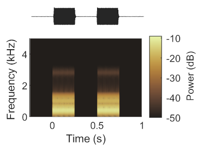
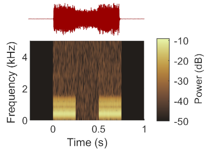

## Stimuli

### Clean sounds
Sounds were synthetic vowels (/a/, /ε/,/i/ and /u/) generated with a 200 Hz fundamental frequency using [Malcolm Slaney's auditory toolbox](https://engineering.purdue.edu/~malcolm/interval/1998-010/) and formant frequencies in the table below. Each vowel had a duration of 250 ms and a rise time of 5 ms, and for consistency with past work, was presented twice on each trial, with a 250 ms interval between tokens (`gf.isi`). Sound level was varied between 50 and 80 dB SPL. Across trials subjects discriminated between a pair vowels from the stimulus set; either /ε/ vs. /u/ (pair 1) or /a/ vs. /i/ (pair 2)


| Pair | Vowel | F1  | F2   |  F3 |  F4 |
|:---:| ----- |:---:| ----:|:----:| ----:|
| 1 | ε     | 730 | 2058 | 2857 | 4205 |
| 1 | u     | 460 | 1105 | 2857 | 4205 |
| 2 | a     | 936 | 1551 | 2975 | 4263 |
| 2 | i     | 437 | 2761 | 2975 | 4263 |     
  
  
Sounds were presented from free-field speakers placed on the left and right of the head, with a sample rate (`gf.fStim`) of 48848 Hz. 
  
```matlab
% Generate sound        
sound  = ComputeTimbreStim(gf.formants);             % create vowel
isi    = zeros(1, ceil(gf.isi/1000 * gf.fStim));     % add interstimulus interval  
holdOK = length(sound) + length(isi);                % point in stimulus that the ferret must hold to        
sound  = [sound, isi, sound];                        % create two vowels with two intervals

% Calibrate sounds
sound0 = conv(sound, gf.fltL.flt, 'same');
sound1 = conv(sound, gf.fltR.flt, 'same');

% Side dependent calibration
[Left_attn, Right_attn] = getCalibAtten;
sound0 = sound0 .* 10 ^(-(Left_attn/20));
sound1 = sound1 .* 10 ^(-(Right_attn/20));   
```




### Noise
Broadband noise (70 dB SPL) was added to target vowels, either continuously throughout testing or in a temporally restricted window around vowel presentation. In both cases, noise was generated afresh on each trial (temporally restricted) or with time (continuous noise).

#### Temporally-restricted Noise

For temporally-restricted conditions, noise was added only from the onset of the first vowel token, to the offset of the second vowel token.

```matlab
noise  = rand(size(sound));
noise  = noise .* 10^(-(gf.noiseAttn/20));
noise  = envelope(noise,ceil(0.005.*gf.fStim));

sound0 = noise + sound0;
sound1 = noise + sound1;
```



#### Continuous noise

In contrast, for continuous conditions, noise was presented thoughout testing, while vowel sounds were presented using the same timing as clean sounds.

```matlab
DA.SetTargetVal( sprintf('%s.enableBgnd', gf.stimDevice), 1);

noiseIdx = DA.GetTargetVal( sprintf('%s.bgndIdx', gf.stimDevice));
           
if gf.noise2write == 1 && noiseIdx >= 50000,                   % Write to first half
    noise  = rand(50000,1);
    noise  = noise .* 10^(-(gf.noiseAttn/20));
    
    DA.WriteTargetVEX(sprintf('%s.bgndNoise', gf.stimDevice), 0, 'F32', noise');
    gf.noise2write = 2;
end

if gf.noise2write == 2 && noiseIdx < 50000,                    % Write to second half
    
    noise  = rand(50000,1);
    noise  = noise .* 10^(-(gf.noiseAttn/20));
    
    DA.WriteTargetVEX(sprintf('%s.bgndNoise', gf.stimDevice), 50000, 'F32', noise');
    gf.noise2write = 1;
end
```


